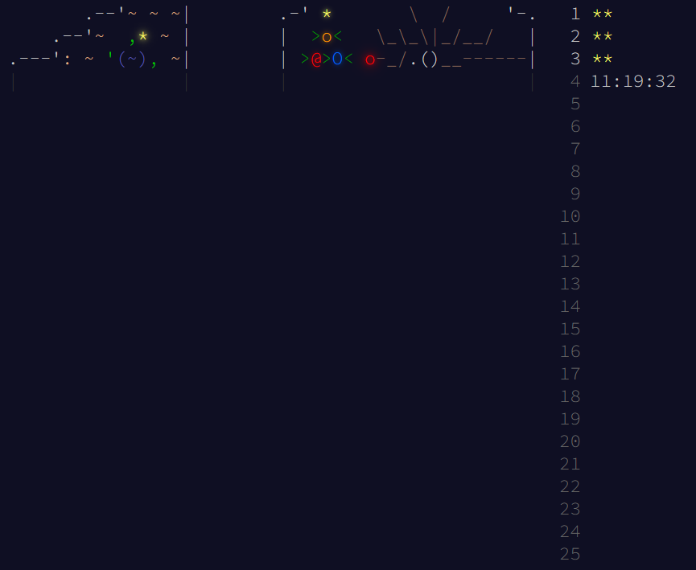

# Advent of Code 2024

Advent of Code is an advent calendar with 2 small programming puzzles per day from December 1st through 25th. You can learn more about it [here](https://adventofcode.com/2024/about).

This repository contains my solutions written in Go, which I chose because I want to improve my familiarity with the language.

## Current Calendar State
